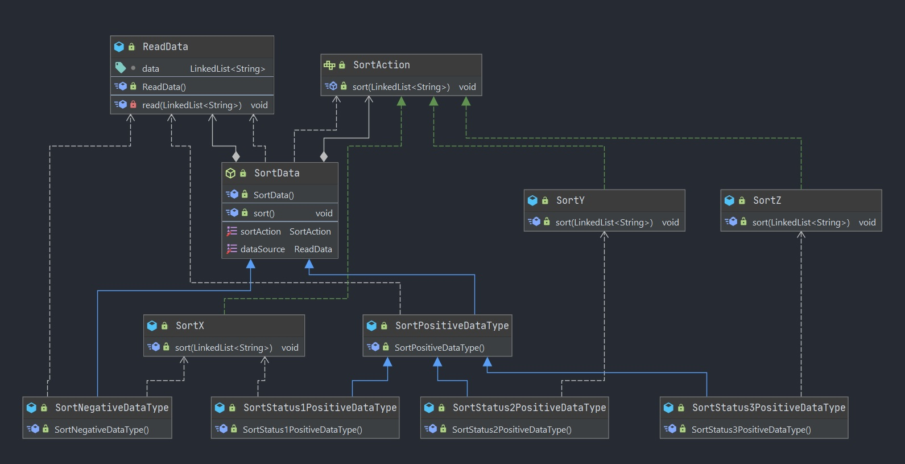

## SortData
Abstract class to read and sort data based on data type and status.

### SortAction
Interface for different sort types

#### SortX
Implements `SortAction` to sort as `SortX`.

#### SortY
Implements `SortAction` to sort as `SortY`.

#### SortZ
Implements `SortAction` to sort as `SortZ`.

### SortPositiveDataType
Class to implement sort where `dataType` is `1`.

#### SortStatus1PositiveDataType
Class to set the sort type when `status` is `1`.

#### SortStatus2PositiveDataType
Class to set the sort type when `status` is `2`.

#### SortStatus3PositiveDataType
Class to set the sort type when `status` is `3`.

### SortNegativeDataType
Class to implement sort where `dataType` is NOT `1`.

### ReadData
Class to read and set the data for sorting.

## UML Class Diagram
