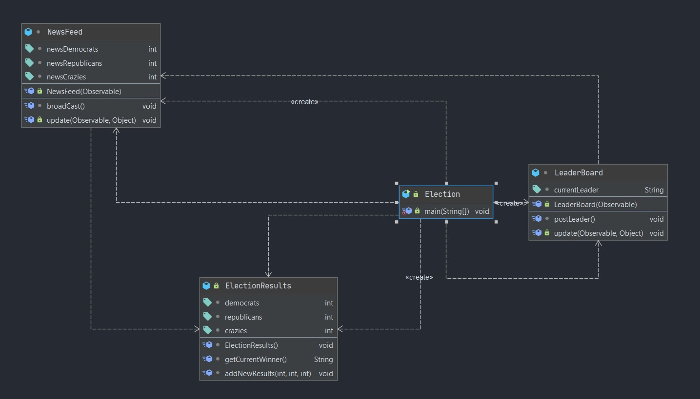

# Election
Java program to work with `Observer` and `Observable` behavior. The `Election` class acts as the entry point and creates object for all the
 relavent classes.
 
## ElectionResults
Observable class which notifies all the news feeds when there is an update.

## NewsFeed
Observer class that observes `ElectionResults` for any update. Also, acts as an observable class for `LeaderBoard`. Whenever there is update, the
 latest winner is notified towards the `NewsFeed` observer.

## LeaderBoard
Observer class that observes `NewsFeed` for any update. Whenever `NewsFeed` is updated, this class updated the leader board.

## UML Class Diagram
